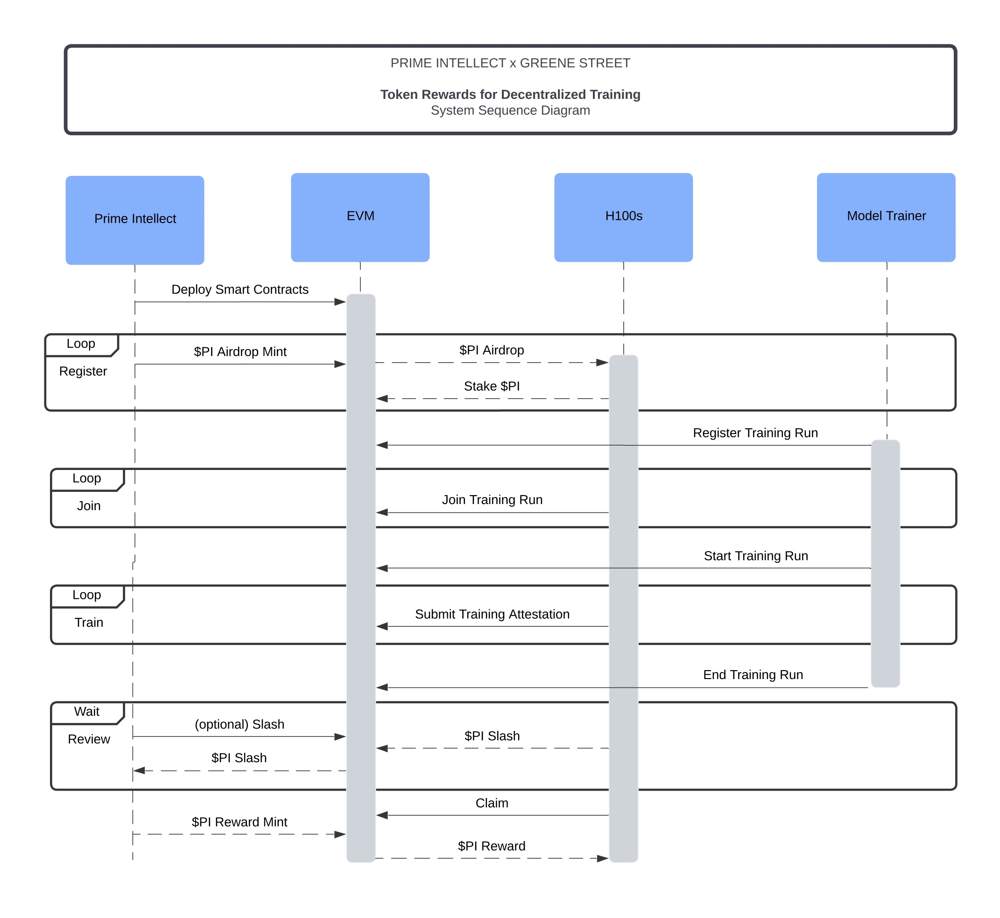

# Prime Intellect Incentives Network

**Prime Intellect is a global compute network that uses smart contracts facilitate trading and rewards between Compute Providers, Model Trainers, and Token Holders.**

This is a Proof-of-Concept (PoC) protocol to demonstrate the power and potential of adding incentives to a global compute network.

The goals of the PoC are as follows:

-   **Register models and compute nodes onchain**
-   **Run training models and submit attestations**
-   **Reward $PIN tokens for valid submissions**

# Documentation

-   **Prime Intellect Network Token (PIN)**: The native token of the Prime Intellect ecosystem.
-   **TrainingManager**: Swiss army knife for interacting with training logic. 
-   **StakingManager**: Manager of token governance for $PIN and training logic.

## Algorithm:

1. Compute nodes added to whitelist.
2. Compute nodes deposit/stake to the network. Compute nodes will be required to maintain a minimum amount of Prime Intellect tokens staked to the network.
3. Training starts, training attestations are submitted, and training ends.
4. Compute nodes can be slashed for providing fake or faulty attestation.
5. The Prime Intellect protocol can distribute PIN tokens to be claimed as rewards by compute providers.

See below for a system diagram of this process.

## System Diagram



## File Overview:

- src
  - interfaces
  - PrimeIntellectToken.sol
  - StakingManager.sol
  - TrainingManager.sol
- test
  - RewardsTest.t.sol
  - ...
- lib
  - forge-std
  - openzeppelin-contracts
- client
  - PrimeIntellectRewards.py

## Developer Usage

This project was developed using forge and tested on a local anvil testnet.

### Build

```shell
$ forge build
```

### Test

```shell
$ forge test
```

### Format

```shell
$ forge fmt
```

### Gas Snapshots

```shell
$ forge snapshot
```

### Anvil

```shell
$ anvil
```

### Deploy Locally

```shell
$ ./script/test.sh
```

### Cast

```shell
$ cast <subcommand>
```

### Help

```shell
$ forge --help
$ anvil --help
$ cast --help
```

# Future

[ ] dynamic rewards per attestation
[ ] stake to model training runs
[ ] stake to compute nodes
[ ] model trainer role
[ ] challenge logic
[ ] upgradeability
[ ] testnet deploy
[ ] security audit
